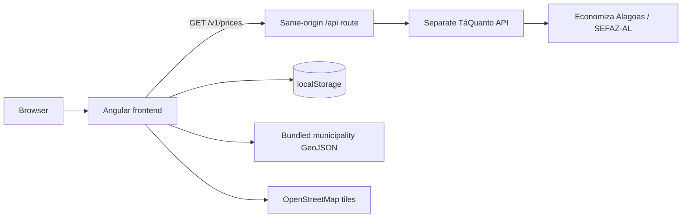

# TáQuanto

<p align="center">
  
</p>

<p align="center">
  A public, accessible price-discovery experience built from real NFC-e sale records in Alagoas, Brazil.
</p>

<p align="center">
  <a href="https://github.com/williamroberttv/taquanto/actions/workflows/ci.yml"></a>
  
  
</p>

TáQuanto turns public price data from Economiza Alagoas/SEFAZ-AL into a focused comparison interface. Visitors can search by product description or GTIN, select any municipality in Alagoas, inspect recent sale records, and save useful records locally without creating an account.

This repository contains the Angular frontend. A separate TáQuanto API protects source credentials, integrates with the official data source, and normalizes its responses. The browser never calls SEFAZ-AL directly.

> Sale records are historical evidence from NFC-e documents. They are not advertisements, guaranteed offers, or current shelf prices.

## What the project demonstrates

- A real public-data product with clear trust boundaries and domain language.
- Modern Angular 22 architecture: standalone components, signals, functional dependency injection, and lazy feature routes.
- Route-level rendering: the public landing page is prerendered while interactive application routes run client-side.
- Resilient API handling with cache-aware polling, timeouts, cancellation, stale-data presentation, and pagination.
- Browser-only recent searches, favorites, and theme persistence with no account requirement.
- Accessible map and dialog interactions, responsive layouts, WCAG AA color targets, keyboard support, and reduced-motion handling.
- Automated linting, Vitest coverage thresholds, reproducible container builds, and GitHub Actions deployment.

## Features

### Public landing page (`/`)

- Explains the source and limits of the price data.
- Presents the three-step search journey and local favorites.
- Uses optimized static imagery and a browser-only Leaflet preview.
- Is prerendered at build time for fast, indexable initial HTML.

### Price search (`/buscar`)

- Searches by a 3–50 character description or an 8, 12, 13, or 14 digit GTIN.
- Filters by municipality and a recent period of 1, 3, 7, or 10 days.
- Loads every Alagoas municipality from the bundled GeoJSON and supports selection by map or native `<select>`.
- Keeps `q`, `municipality`, and `days` in the URL so a search can be revisited or shared.
- Shows up to 50 records per page with accessible pagination.
- Displays sale value, unit, product, establishment, time, address, GTIN, and declared value when it differs.
- Opens a native dialog with the full record and a map marker only when the source provides valid coordinates.
- Preserves responsive loading, empty, validation, stale-cache, and failure states.

### Recent searches

- Stores the 10 most recent unique combinations of query, municipality, and period.
- Lets visitors repeat a complete search from its card.
- Remains on the current browser through `localStorage`; it is not an account history.

### Favorites (`/favoritos`)

- Saves an immutable snapshot of a selected NFC-e sale record in `localStorage`.
- Lists the newest saved record first and prevents duplicate snapshots.
- Supports removal from either search results, record details, or the favorites page.
- Shows a map only when the saved source record includes valid coordinates.

### Theme and accessibility

- Provides custom light and dark TáQuanto themes built with Tailwind CSS and daisyUI.
- Uses the saved preference first, then the operating-system preference.
- Includes semantic landmarks, labels, live status messages, native dialogs, visible focus states, 44 px interaction targets, and keyboard-operable municipality shapes.
- Disables nonessential motion when `prefers-reduced-motion` is enabled.

## Architecture



The frontend owns presentation and ephemeral browser state. The API owns source integration, credentials, normalization, and cache policy.

| Route        | Loading | Rendering                 | Reason                                                         |
| ------------ | ------- | ------------------------- | -------------------------------------------------------------- |
| `/`          | Eager   | Prerendered at build time | Public, stable content benefits from SEO and fast first paint. |
| `/buscar`    | Lazy    | Client-side               | Search depends on browser state and live API requests.         |
| `/favoritos` | Lazy    | Client-side               | Favorites are private to the current browser.                  |

The production build uses Angular's static output mode. CloudFront serves the generated files from S3 and falls back to `index.csr.html` for client routes; there is no Node SSR process.

### Search and cache flow

1. The UI validates the query and sends the selected municipality, period, page, and page size to the TáQuanto API.
2. A fresh cache hit is rendered immediately.
3. A stale response remains visible while the client revalidates every five seconds.
4. An accepted cache miss is polled without blocking the interface.
5. Polling stops on fresh data, a terminal error, user cancellation, or the two-minute limit.

Transient timeouts and gateway failures are retried during that window. Other failures surface an actionable message. Changing the query or filters cancels obsolete work.

## Technology

| Area       | Choice                                                |
| ---------- | ----------------------------------------------------- |
| Framework  | Angular 22, Angular Router, Angular SSR build tooling |
| Language   | TypeScript 6 in strict mode                           |
| State      | Angular signals and computed state                    |
| Async data | Angular `HttpClient` and RxJS                         |
| Styling    | Tailwind CSS 4 and daisyUI 5 with custom themes       |
| Maps       | Leaflet, OpenStreetMap, and a bundled Alagoas GeoJSON |
| Testing    | Angular unit-test builder, Vitest, jsdom, V8 coverage |
| Quality    | ESLint, Prettier, Angular production budgets          |
| Delivery   | GitHub Actions, Amazon S3, CloudFront, optional Nginx |

## Run locally

### Prerequisites

- Node.js 22
- npm 11
- The separate TáQuanto API running at `http://localhost:8080` for live searches

Install the locked dependency tree and start the development server:

```bash
npm ci
npm start
```

Open `http://localhost:4200/`. The landing page and browser-only features work without the API; price searches require the backend.

The development API base URL lives in `src/environments/environment.development.ts`. Production uses the same-origin `/api` path from `src/environments/environment.ts`.

## Commands

| Command                 | Purpose                                                  |
| ----------------------- | -------------------------------------------------------- |
| `npm start`             | Start the Angular development server.                    |
| `npm run build`         | Create the optimized static production build.            |
| `npm run watch`         | Rebuild continuously with the development configuration. |
| `npm test`              | Run the Vitest suite.                                    |
| `npm run test:coverage` | Run tests with V8 coverage.                              |
| `npm run lint`          | Lint Angular TypeScript and templates.                   |

Coverage must remain at or above 75% for statements, branches, functions, and lines. Pull requests to `main` run lint and coverage in CI.

## API contract used by the frontend

The search service calls:

```http
GET /v1/prices?query=<text-or-gtin>&municipality=<ibge-code>&days=<1-10>&limit=50&page=<number>
```

The response contains normalized sale records and pagination metadata. The frontend also validates the API cache protocol:

| Response                                 | Meaning                  | Client behavior                   |
| ---------------------------------------- | ------------------------ | --------------------------------- |
| `200`, `X-Cache: HIT`                    | Fresh result             | Render and stop polling.          |
| `200`, `X-Cache: STALE`                  | Usable cached result     | Render, label it, and revalidate. |
| `202`, `X-Cache: MISS`, `Retry-After: 5` | Search is being prepared | Wait five seconds and retry.      |

Unexpected status/header combinations are rejected instead of being treated as valid data. Requests time out after five seconds.

## Production deployment

Pushes to `main` deploy `dist/taquanto/browser` through GitHub Actions. The
`production` environment must define these secrets:

- `AWS_REGION`
- `AWS_DEPLOY_ROLE_ARN`
- `S3_BUCKET`
- `CLOUDFRONT_DISTRIBUTION_ID`

The workflow authenticates with AWS through GitHub OIDC, synchronizes the build
with S3, removes stale files, and waits for the CloudFront invalidation to
complete. CloudFront is responsible for routing `/api/*` to the TáQuanto API and
falling back to `index.csr.html` for client-rendered routes.

## Optional production container

Build and run the static Nginx image:

```bash
docker build -f ci/prod/Dockerfile -t taquanto-frontend .
docker run --rm -p 8080:80 taquanto-frontend
```

Open `http://localhost:8080/`. A production deployment must route the same-origin `/api` prefix to the TáQuanto API before requests reach this static frontend container.

## Project structure

```text
src/app/
├── components/       Shared header, footer, favorite control, and municipality map
├── pages/            Landing, search, and favorites route components
├── services/         API client, cache polling, favorites, and theme state
├── app.routes.ts     Browser routes and lazy-loading boundaries
└── app.routes.server.ts  Route-level prerender/CSR policy
public/
├── assets/           Alagoas municipality GeoJSON
└── images/           TáQuanto visual assets
ci/prod/              Production Dockerfile and Nginx configuration
```

## Documentation

- [Domain language and product boundaries](CONTEXT.md)
- [Design system and accessibility rules](DESIGN.md)

## Product boundaries and roadmap

The public product search, record details, recent searches, favorites, and themes are implemented. Authentication, cross-device synchronization, saved-search alerts, consumer accounts, and personalized history are intentionally outside the current scope.

Future work must preserve these rules:

- Basic price search remains public.
- Source credentials never reach browser code.
- Missing coordinates never become invented map points.
- Historical records are never presented as promotions or guaranteed prices.

## Author

Developed by [William Tavares](https://www.linkedin.com/in/williamtavares/).
